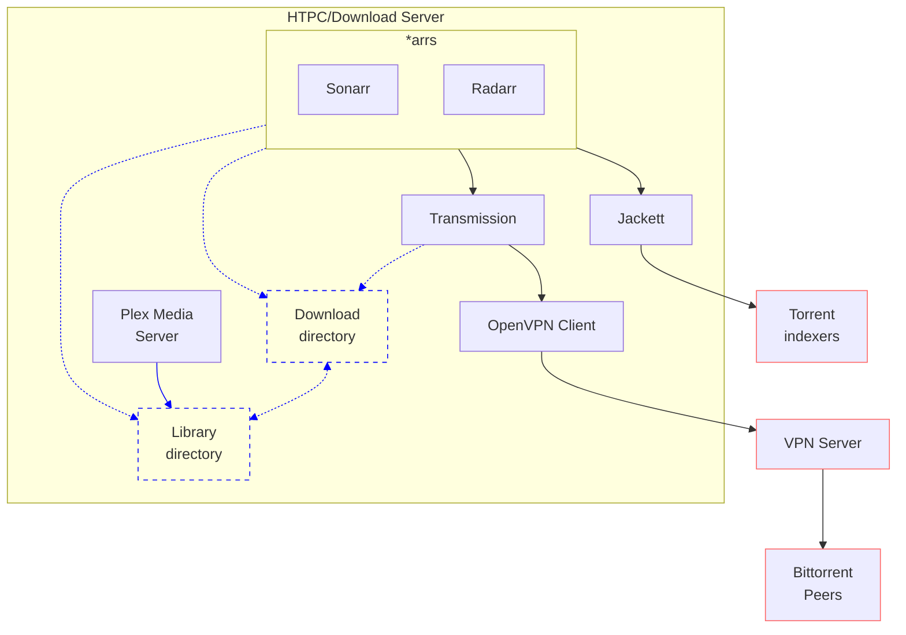

# Martin's Self-hosting setup
[](https://github.com/martinbjeldbak/raspberry-pi/actions/workflows/lint.yml)

Inspired by Ben Balter's [blog](https://ben.balter.com/2020/12/04/over-engineered-home-network-for-privacy-and-security/) [posts](https://ben.balter.com/2021/09/01/how-i-re-over-engineered-my-home-network/) and his repository [benbalter/pi-hole-cloudflared-docker-compose-ansible-caddy](https://github.com/benbalter/pi-hole-cloudflared-docker-compose-ansible-caddy) and <https://github.com/sebgl/htpc-download-box>



* [Portainer](https://github.com/portainer/portainer) - UI to help manage containers
* [Adguard Home](https://github.com/AdguardTeam/AdGuardHome) - self-hosted DNS server with ad-blocking
* [Plex Media Server](https://www.plex.tv) - connects to my Synology NAS and hosts database
* [Home Assistant](https://www.home-assistant.io) - integrates all my IoT devices
* [Transmission](https://transmissionbt.com) - torrent client used by Radarr and Sonarr to fetch media
* [Radarr](https://radarr.video) - monitor & download movies
* [Sonarr](https://sonarr.tv) - monitor & download TV shows
* [Jackett](https://github.com/Jackett/Jackett) - proxy supporting private torrent tracker integration with Radarr & Sonarr
* [Caddy](https://caddyserver.com) - HTTPS support with Let's Encrypt
* [Bazarr](https://github.com/morpheus65535/bazarr) - fetch subtitles for Sonarr and Radarr

all of these services are managed via docker using docker-compose.

## Prerequisites

Ansible installed on control node. See installation guide [here](https://docs.ansible.com/ansible/latest/installation_guide/index.html) or install it via brew if on macOS:

```sh
brew install ansible 1password-cli
```

Install Ansible Galaxy packages with the below commands

```sh
ansible-galaxy install -r requirements.yml
ansible-galaxy collection install community.general
ansible-galaxy collection install community.docker
ansible-galaxy collection install community.crypto
```

I am assuming you are using a password manager. In these scripts, I use the 1Password CLI [`op`](https://support.1password.com/command-line/) which has ansible collection support. Most major password managers will have Ansible support.

You will also need to populate your own `.env` file, copied from [`.env.example`](.env.example)

## Usage

1. Download the [Raspberry Pi Imager](https://www.raspberrypi.org/software/) and flash the latest version of Raspberry Pi OS Lite `brew install raspberry-pi-imager`
1. Add an empty `ssh` file to the boot partition to enable the SSH server
1. Once Raspberry Pi online, copy your SSH public key to it via `ssh-copy-id pi@raspberrypi.local`
1. Run `ansible-playbook playbook.yml --inventory hosts.yml`
1. Sit back and wait until you have a fully configured PiHole running in about 5-10 minutes

You may need to make some changes in [`hosts.yml`](/hosts.yml) to match the static IP of your Raspberry Pi.

Once booted, manually configure, or restore from backup

* Portainer
* Jackett, adding private trackers
* Sonarr
* Radarr
* Bazarr

## On the list to do

- [x] Make all services work over HTTPS
- [ ] Buy upgraded NAS, move jackett, sonarr, radarr, plex & transmission setup there
- [ ] Add rsync to ansible for backup
