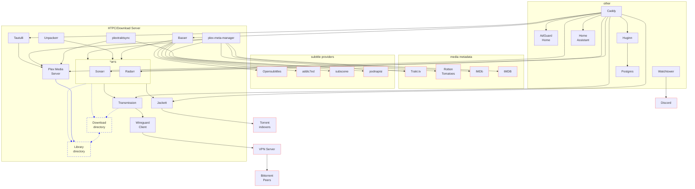

# Martin's Self-hosting setup

Inspired by Ben Balter's [blog](https://ben.balter.com/2020/12/04/over-engineered-home-network-for-privacy-and-security/) [posts](https://ben.balter.com/2021/09/01/how-i-re-over-engineered-my-home-network/) and his repository [benbalter/pi-hole-cloudflared-docker-compose-ansible-caddy](https://github.com/benbalter/pi-hole-cloudflared-docker-compose-ansible-caddy) and <https://github.com/sebgl/htpc-download-box>

* [Adguard Home](https://github.com/AdguardTeam/AdGuardHome) - self-hosted DNS server with ad-blocking
* [Plex Media Server](https://www.plex.tv) - connects to my Synology NAS and hosts database
* [PlexTraktSync](https://github.com/Taxel/PlexTraktSync) - syncs library and watch status to Trakt.tv
* [Plex Meta Manager](https://metamanager.wiki/en/latest/) - maintains Plex collections and playlists from configuration files
* [Tautulli](https://tautulli.com/) - UI to monitor Plex statistics
* [Home Assistant](https://www.home-assistant.io) - integrates all my IoT devices
* [Transmission](https://transmissionbt.com) - torrent client used by Radarr and Sonarr to fetch media
* [Radarr](https://radarr.video) - monitor & download movies
* [Sonarr](https://sonarr.tv) - monitor & download TV shows
* [Lidarr](https://lidarr.audio) - monitor & download albums
* [Bazarr](https://github.com/morpheus65535/bazarr) - fetch subtitles for Sonarr and Radarr
* [Jackett](https://github.com/Jackett/Jackett) - proxy supporting private torrent tracker integration with Radarr, Sonarr, Lidarr
* [Unpackerr](https://github.com/davidnewhall/unpackerr) - extracts files for Radarr, Sonarr, Lidarr
* [Caddy](https://caddyserver.com) - reverse proxy server
* [Gluetun](https://github.com/qdm12/gluetun) - VPN client with Wireguard support. Transmission and Jackett connections are tunneled through this
* [Watchtower](https://containrrr.dev/watchtower/) - check for container updates nightly
* [Huginn](https://github.com/huginn/huginn) - allows configuring agents
* [PostgreSQL](https://www.postgresql.org/) - for any apps that need a database. Huginn only at the moment

all of these services are managed via docker using docker-compose.

Once running, many need to be configured via their UIs. In my case, volume folders are backed up using Synology Hyper Backup to Backblaze B2.
